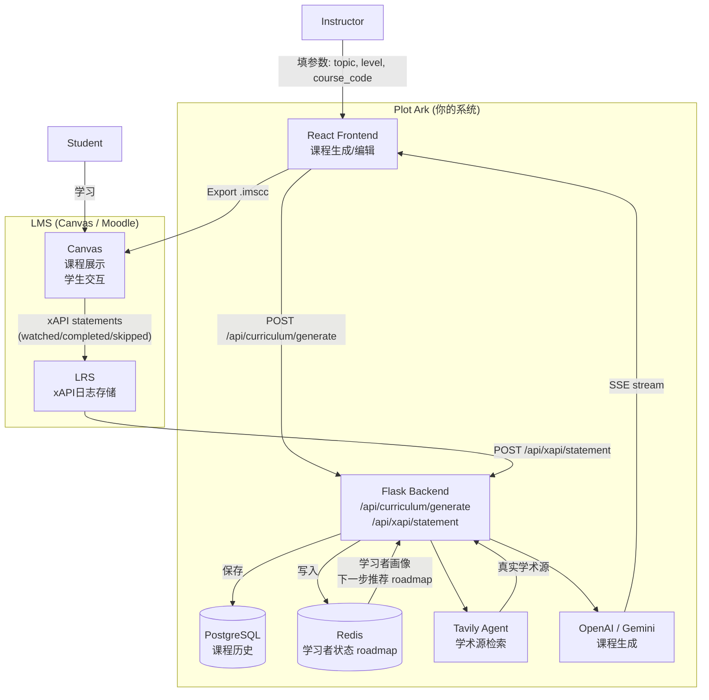

```mermaid
flowchart TD
    subgraph plotark["Plot Ark (你的系统)"]
        UI["React Frontend\n课程生成/编辑"]
        BE["Flask Backend\n/api/curriculum/generate\n/api/xapi/statement"]
        DB[(PostgreSQL\n课程历史)]
        REDIS[(Redis\n学习者状态 roadmap)]
        TAVILY["Tavily Agent\n学术源检索"]
        LLM["OpenAI / Gemini\n课程生成"]
    end

    subgraph LMS["LMS (Canvas / Moodle)"]
        CANVAS["Canvas\n课程展示\n学生交互"]
        LRS["LRS\nxAPI日志存储"]
    end

    INSTRUCTOR["Instructor"]
    STUDENT["Student"]

    INSTRUCTOR -->|"填参数: topic, level, course_code"| UI
    UI -->|"POST /api/curriculum/generate"| BE
    BE --> TAVILY
    TAVILY -->|"真实学术源"| BE
    BE --> LLM
    LLM -->|"SSE stream"| UI
    BE -->|"保存"| DB

    UI -->|"Export .imscc"| CANVAS
    STUDENT -->|"学习"| CANVAS
    CANVAS -->|"xAPI statements\n(watched/completed/skipped)"| LRS
    LRS -->|"POST /api/xapi/statement"| BE
    BE -->|"写入"| REDIS
    REDIS -->|"学习者画像\n下一步推荐 roadmap"| BE
```
